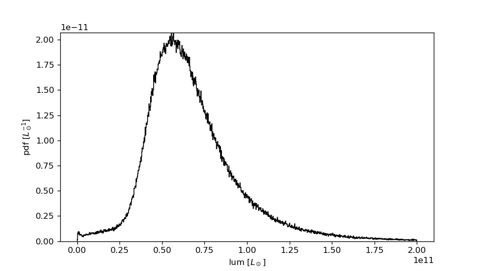
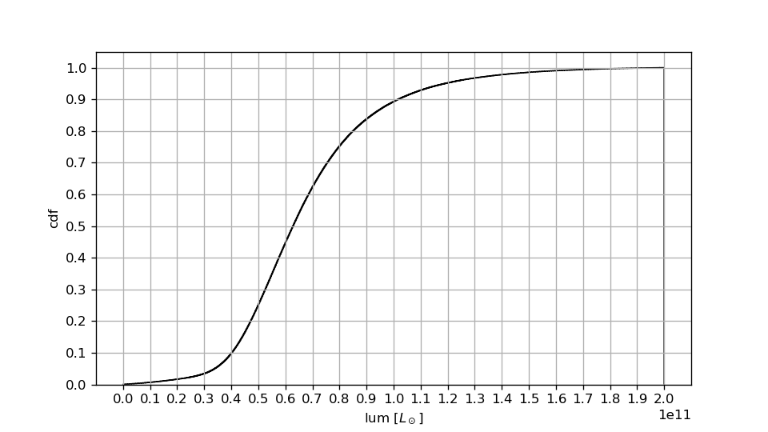

# Kcorrected catalog

This script uses kcorrect to generate galaxy kcorrected luminosities
from ugriz sdss bands.

Requirements: kcorrect (C version), numpy, matplotlib for plots.

## Description

Kcorrection is done the way described in Blanton's kcorrect manual with
subsequent conversions to solar luminosities.

Steps are:
1. Convert luptitudes to maggies ussing conventions outlined in the SDSS documentation. Formulas were checked against lup2mags in the IDL side of kcorrect.
2. Feed kcorrect with the right maggies for the kcorrection
3. Compute the kcorrection at z=0.1
4. Convert to absolute magnitudes and convert to luminosities.

## Usage
In bash run 

	runKcorrection.sh path/to/catalog.csv
The directory "output" now has your kcorrected luminosity catalog. To make plots run plot_hist.py /path/to/kcorrectedcatalog.csv, then directory output will show something like:

## Author
Written by P. Gallardo Sept 2020 with input from V. Calafut and F. de Bernardis.
